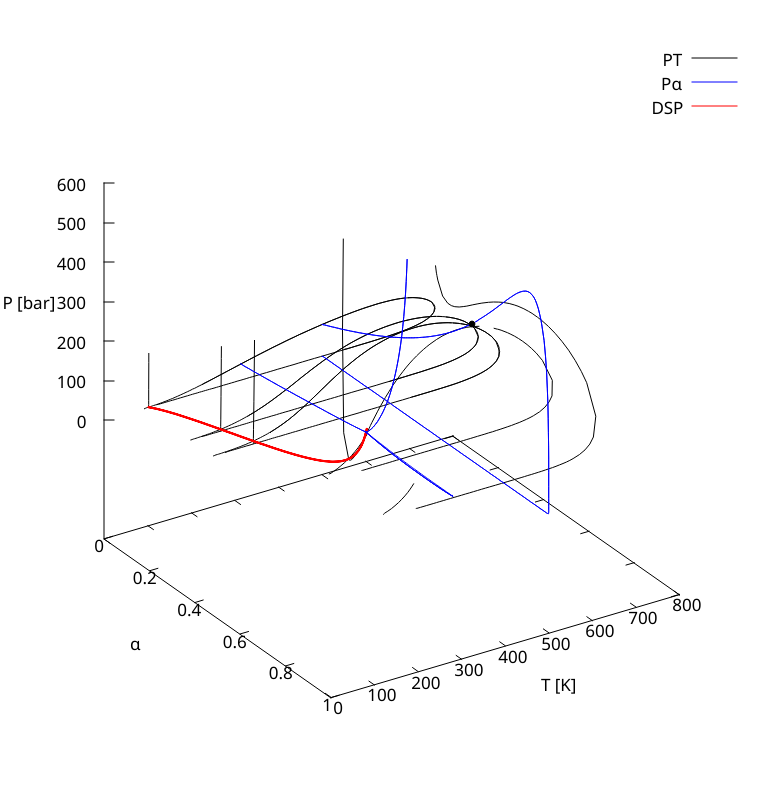

# fenvelopes: Phase diagrams with Equations of State.



This is an ongoing project that intends te be a fully fledged generator of
phase equilibria diagrams from multicomponent systems, using Equations of
State.

## Capabilities
Right now `fenvelopes` calculates three kinds of phase-envelopes.

- [x] Two-phase PT envelopes
- [ ] Three-phase PT envelopes
    - [x] PT envelopes based on double saturation points.
    - [ ] Isolated PT envelopes
- [ ] DSP lines:
    - [x] DSP lines from a PT DSP
- [x] Two-phase Px envelopes
- [ ] Three-phase Px envelopes
    - [x] Px envelopes based on double saturation points.
    - [ ] Isolated Px envelopes:
        - [x] Isolated Px from PT
        - [ ] Isolated Px from search
- [ ] Python wrappers to ease up scripting and plotting.

## Usage
This program is intended to be used as a `CLI` software. The command used to
calculate phase diagrams is:

```bash
fenvelopes --infile input_file.nml
```

This will generate an `fenvelopes_output` directory. Which contains all the
generated output files with the relevant data.

### Input files
The input files 

```fortran
! input.nml
!
! Namelist based input file
! =========================
!
! Units:
!  - Pressure: bar
!  - Temperature: K
!  - Volume: L
! =========================


&nml_setup
    ! General settings
    nc=5,                ! Number of components
    model="PR78",        ! SRK PR76 PR78
    mixrule="ClassicVdW" ! only ClassicVdW for now
/

&nml_composition
    names="PC1" "PC2" "PC3" "PC4" "H2O"
    spec="critical", ! critical or parameters specification
    z=0.15 0.10 0.10 0.15 0.50
/

&nml_classicvdw ! Classic VdW mixing rule parameters
    ! kij matrix
    kij(1, :)=0      0      0      0      0.7192
    kij(2, :)=0      0      0      0      0.4598
    kij(3, :)=0      0      0      0      0.2673
    kij(4, :)=0      0      0      0      0.2417
    kij(5, :)=0.7192 0.4598 0.2673 0.2417 0
    
    ! lij matrix
    lij(:, :) = 0
/

&nml_critical
    ! Critical constants
    
    ! Critical Temperature
    tc=305.586 638.889 788.889 838.889 647.3
    
    ! Critical Pressure
    pc=48.82 19.65 10.2 7.72 220.89

    ! Acentric Factor
    w=0.098 0.535 0.891 1.085 0.344
/

&nml_px ! Px envelopes relevant info
    ! Temperature
    T=350.0
    
    ! Initial composition, ussualy the same as the main fluid.
    z_0=0.15 0.10 0.10 0.15 0.50 
    
    ! Injection fluid composition
    z_injection=1 0 0 0 0

    ! Which kind of injection to realize
    injection_case="displace" ! [dilute|displace]
/
```

### Output
All the output is directed to a generated folder `fenvelopes_output`. With the files

`env-<nphases>ph-<env_kind>_<envnumber>.dat`

Were all the envelope's calculated points are written in a `csv-like` format,
delimited by spaces.

## Installation
This program uses [`fpm`](https://fpm.fortran-lang.org) as a builder. `fpm`
handles all the needed dependencies and compiling procedures.
It is distributed in many ways, but we recommend the `pip` distribution. 

```bash
# using pipx
pipx install fpm
```

To install this program is as simple as:

```
git clone https://www.github.com/fedebenelli/envelopes
cd envelopes
fpm install --profile release
```
This will make `fenvelopes` accessible from any directory of your computer

If you don't want to install the program and just run it you can also run it
with `fpm`

```bash
fpm run --profile release -- --infile <infile.nml PATH>
```

