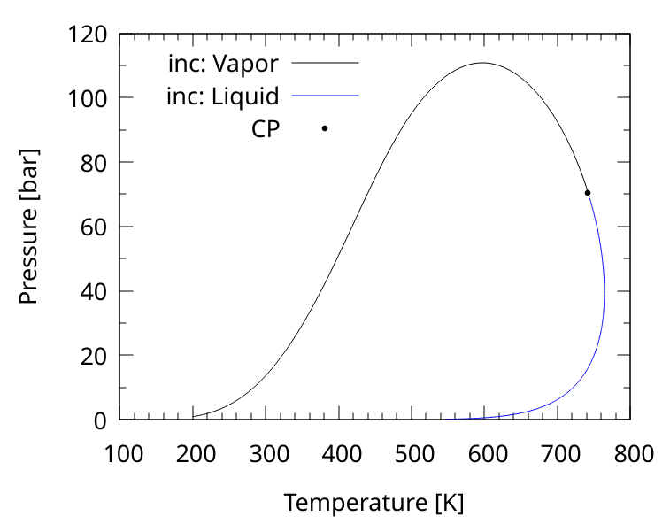

# envelopes
Simple program to calculate biphasic phase envolopes

## Input files
The program assumes there is a `input.nml` file at it's path, which contains
all the relevant data for the system.

```fortran
! Namelist based input file
! =========================
!
! Units:
!  - Pressure: bar
!  - Temperature: K
!  - Volume: L
! =========================


&nml_setup
    nc=5,                ! Number of components
    model="PR78",        ! SRK PR76 PR78
    mixrule="ClassicVdW" ! only ClassicVdW
/

&nml_composition
    names="PC1" "PC2" "PC3" "PC4" "H2O"
    spec="critical", ! critical or parameters
    z=0.15 0.10 0.10 0.15 0.50
/

&nml_classicvdw
    ! kij matrix
    kij(1, :)=0	0	0	0	0.7192
    kij(2, :)=0	0	0	0	0.4598
    kij(3, :)=0	0	0	0	0.2673
    kij(4, :)=0	0	0	0	0.2417
    kij(5, :)=0.7192	0.4598	0.2673	0.2417	0
    ! lij matrix
    lij(:, :) = 0
/

&nml_critical
    ! Critical constants
    
    ! Critical Temperature
    tc=305.586 638.889 788.889 838.889 647.3
    
    ! Critical Pressure
    pc=48.82 19.65 10.2 7.72 220.89

    ! Acentric Factor
    w=0.098 0.535 0.891 1.085 0.344
/
```

## Execution
This program is intended to work with `fpm`, to run it just use `fpm run`

## Output
Several output files are produced, `X_it*` files correspond to each iteration
point, `ENV2_OUT*` files correspond to the phase envelope structured to plot
with gnuplot, and there is also an `output.csv` file that contains the same
information but on another format.

There is a simple `gnuplot` script to plot the phase envelope, just run
`gnuplot plot.gnu` to make the plot. It should look like this:


